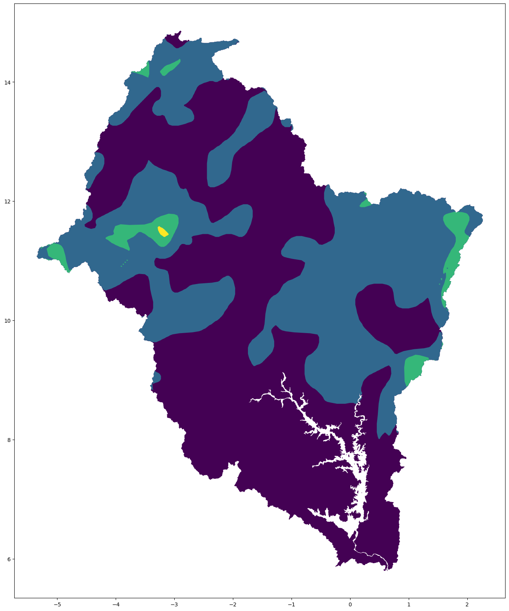

# Raster2GeoJSON
A simple tool to convert raster images to GeoJSON polygons, with smoothing, hole removal and masking.

## Installation
This tool requires Python3. To install, simply clone this repository and run `pip install -r requirements.txt` in the root directory.

## Usage
To use this tool, run `python raster2geojson.py <input_file> <output_file> [options]`. 
The input file must be a raster geotiff and the output file must be a GeoJSON file.

### Optional arguments
Some optional arguments can be passed to the script:
- `--holes`: path to holes file
- `--mask`: path to mask file
- `--values`: values to extract
- `--smooth`: Smoothing factor (defaults to 0.8)
- `--format`: GeoJSON format (defaults to "GeoJSON", can be "shapefile" or "gpkg")

## Example
```bash
python raster2geojson.py data/raster.tif data/output.geojson --holes data/holes.geojson --mask data/mask.geojson
```


Input image:


Output GeoJSON:
